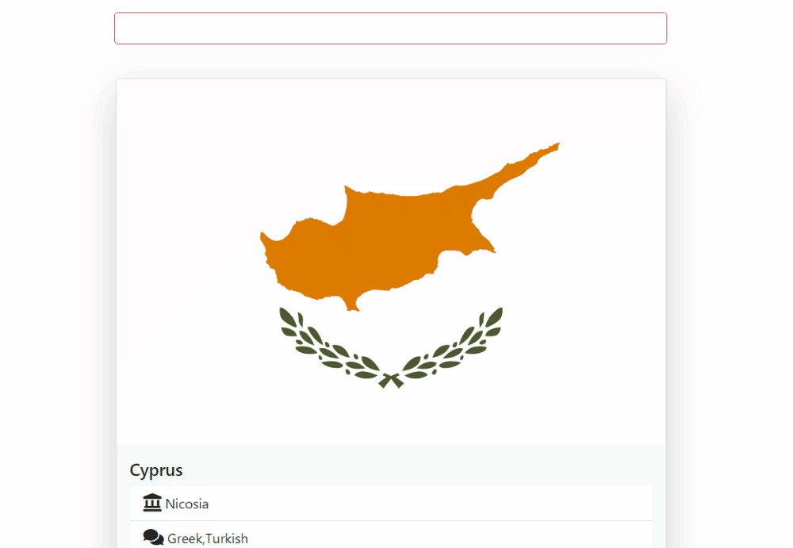

# Countries-App

- This JavaScript code challenge involves fetching all countries data from the "All Countries" [https://restcountries.com/v3.1/all](https://restcountries.com/v3.1/all)  and displaying all countries information on the DOM. 
- The challenge demonstrates how to retrieve data from an API and present it within an HTML document.

## Expected Outcome

